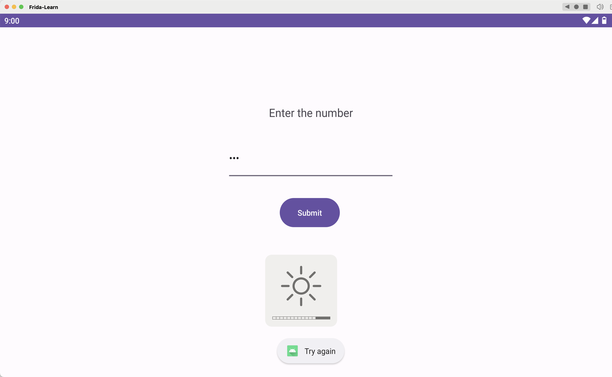
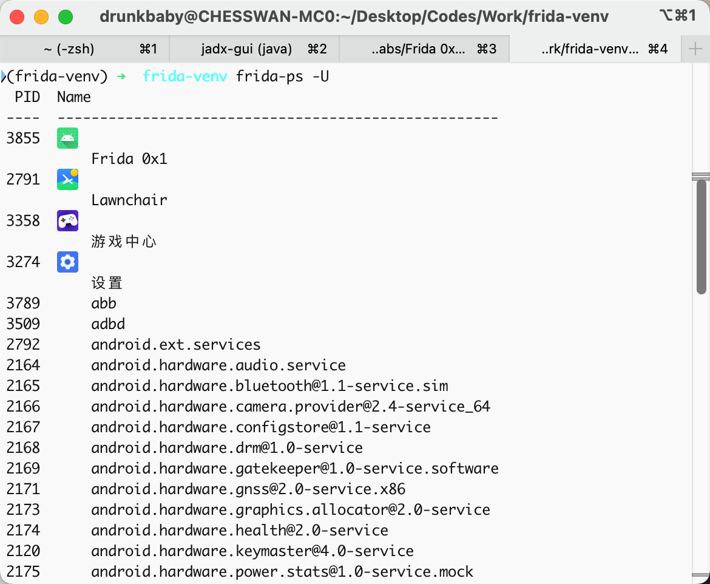
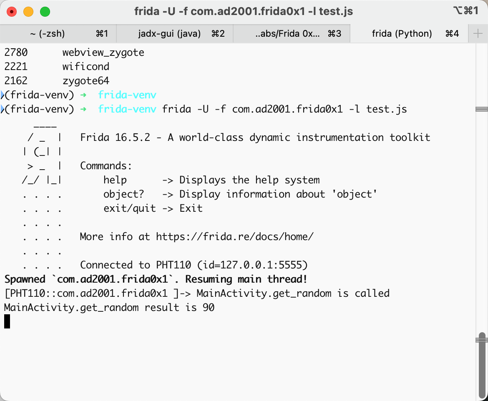
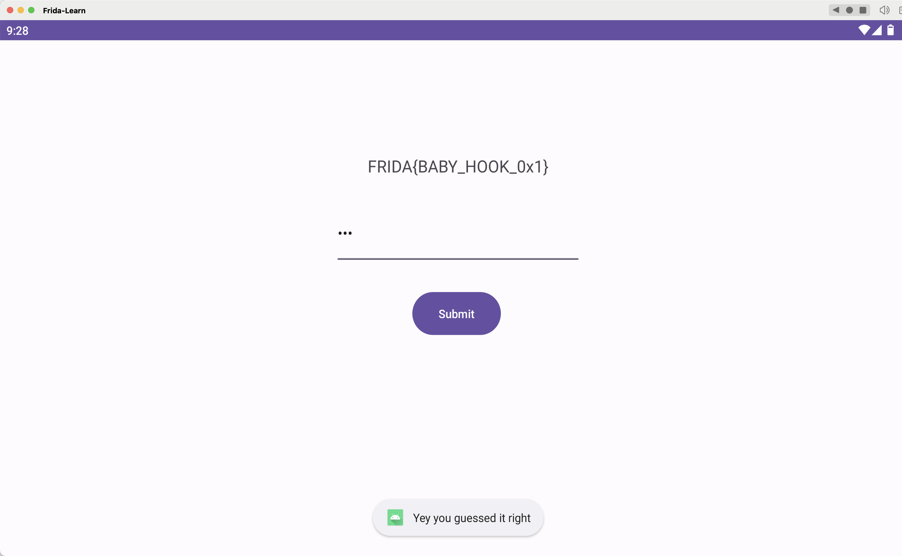

## Lab 01 Hook 方法

安装 APK

```bash
adb install /Users/drunkbaby/Desktop/Codes/APK/Frida-Labs/Frida\ 0x1/Challenge\ 0x1.apk
```

直接输入 123，会提示 Try Again



用 jadx 打开 apk。可以先用看看 Main 函数，里面有关于 flag 的主要判断逻辑很容易

```java
void check(int i, int i2) {  
        if ((i * 2) + 4 == i2) {  
            Toast.makeText(getApplicationContext(), "Yey you guessed it right", 1).show();  
            StringBuilder sb = new StringBuilder();  
            for (int i3 = 0; i3 < 20; i3++) {  
                char charAt = "AMDYV{WVWT_CJJF_0s1}".charAt(i3);  
                if (charAt < 'a' || charAt > 'z') {  
                    if (charAt >= 'A') {  
                        if (charAt <= 'Z') {  
                            charAt = (char) (charAt - 21);  
                            if (charAt >= 'A') {  
                            }  
                            charAt = (char) (charAt + 26);  
                        }  
                    }  
                    sb.append(charAt);  
                } else {  
                    charAt = (char) (charAt - 21);  
                    if (charAt >= 'a') {  
                        sb.append(charAt);  
                    }  
                    charAt = (char) (charAt + 26);  
                    sb.append(charAt);  
                }  
            }  
            this.t1.setText(sb.toString());  
            return;  
        }  
        Toast.makeText(getApplicationContext(), "Try again", 1).show();  
    }
```

i 是 random 产生的字符串，i2 是我们输入的字符串。要求让 `i * 2  + 4 = i2`，才能输出 flag。然而尽管这里不 frida 也可以直接写脚本拿到 flag —— exp.py

```python
def decode_char(char):
    if 'A' <= char <= 'Z':
        decoded_char = chr(ord(char) - 21)
        if decoded_char < 'A':
            decoded_char = chr(ord(decoded_char) + 26)
        return decoded_char
    elif 'a' <= char <= 'z':
        decoded_char = chr(ord(char) - 21)
        if decoded_char < 'a':
            decoded_char = chr(ord(decoded_char) + 26)
        return decoded_char
    else:
        return char

def decode_string(encoded_str):
    decoded_str = []
    for i in range(min(20, len(encoded_str))):
        decoded_str.append(decode_char(encoded_str[i]))
    return ''.join(decoded_str)

if __name__ == "__main__":
    encoded_string = "AMDYV{WVWT_CJJF_0s1}"
    decoded_string = decode_string(encoded_string)
    print(f"Decoded string: {decoded_string}")
```

下面来看 frida 是怎么 hook 的

```bash
// 模拟器上开启 frida-server
adb shell /data/local/tmp/frida-server &

// 进行端口转发监听
adb forward tcp:27042 tcp:27042
adb forward tcp:27043 tcp:27043
```

最后输入 **frida-ps -U** 或者 **frida-ps -R**看看能否成功输出进程列表，检查 frida 能否正常使用。



我们还需编写脚本

```javascript
// 使用Java.perform函数创建一个特殊的Java上下文，用于执行挂钩和Java类操作
Java.perform(function() {
    // 获取应用程序中com.ad2001.frida0x1.MainActivity类的引用
    var MainActivity = Java.use("com.ad2001.frida0x1.MainActivity");

    // 重写MainActivity类的get_random方法的实现
    MainActivity.get_random.implementation = function() {
        // 当get_random方法被调用时，输出一条日志信息
        console.log("MainActivity.get_random is called");

        // 调用原始的get_random方法并获取其返回值，这里直接写成 1 也可以
        var ret_val = this.get_random();

        // 输出get_random方法的返回结果
        console.log("MainActivity.get_random result is " + ret_val);

        // 返回原始方法的返回值
        return ret_val;
    };
});
```

保存好，然后我们使用 **frida -U -f com.ad2001.frida0x1 -l test.js** (test.js是脚本的绝对路径)



再在jadx中点击运行，就可以看到输出了此次app运行时生成的随机数是多少，这里 random 被固定死了为 90，所以只需要输入 184 就可以得到 flag




Frida Hook 方法的脚本模板

```javascript
Java.perform(function() {

var <class_reference> = Java.use(“<package_name>.<class>”);

<class_reference>.<method_to_hook>.implementation = function(<args>) {

     /*

       我们自己的方法实现

     */

   }
}
```
