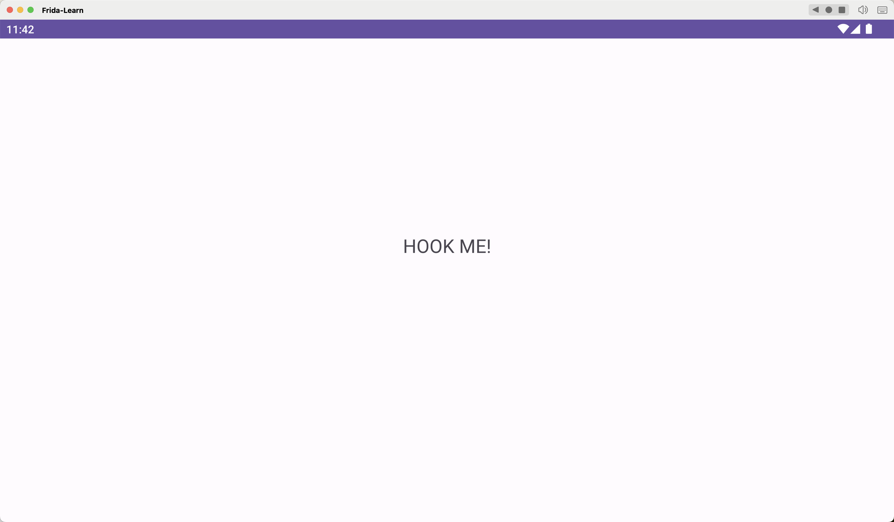
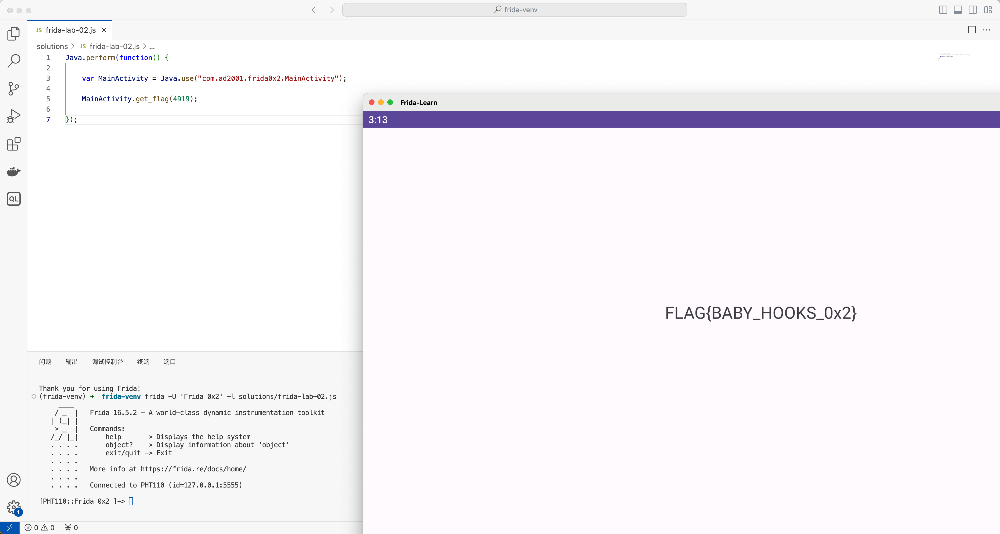

## Lab 02 调用静态方法

打开 apk，显示 hook me




去看 MainActivity，代码如下

```java
public class MainActivity extends AppCompatActivity {  
    static TextView t1;  
  
    /* JADX INFO: Access modifiers changed from: protected */  
    @Override // androidx.fragment.app.FragmentActivity, androidx.activity.ComponentActivity, androidx.core.app.ComponentActivity, android.app.Activity  
    public void onCreate(Bundle savedInstanceState) {  
        super.onCreate(savedInstanceState);  
        setContentView(R.layout.activity_main);  
        t1 = (TextView) findViewById(R.id.textview);  
    }  
  
    public static void get_flag(int a) {  
        if (a == 4919) {  
            try {  
                SecretKeySpec secretKeySpec = new SecretKeySpec("HILLBILLWILLBINN".getBytes(), "AES");  
                Cipher cipher = Cipher.getInstance("AES/CBC/PKCS5Padding");  
                IvParameterSpec iv = new IvParameterSpec(new byte[16]);  
                cipher.init(2, secretKeySpec, iv);  
                byte[] decryptedBytes = cipher.doFinal(Base64.decode("q7mBQegjhpfIAr0OgfLvH0t/D0Xi0ieG0vd+8ZVW+b4=", 0));  
                String decryptedText = new String(decryptedBytes);  
                t1.setText(decryptedText);  
            } catch (Exception e) {  
                e.printStackTrace();  
            }  
        }  
    }  
}
```

脚本一把梭的方法

```python
from Crypto.Cipher import AES
from Crypto.Util.Padding import unpad
import base64

def decrypt_flag():
    try:
        key = b'HILLBILLWILLBINN'
        iv = bytes([0] * 16)
        encrypted_data = base64.b64decode("q7mBQegjhpfIAr0OgfLvH0t/D0Xi0ieG0vd+8ZVW+b4=")

        cipher = AES.new(key, AES.MODE_CBC, iv)
        decrypted_bytes = unpad(cipher.decrypt(encrypted_data), AES.block_size)
        decrypted_text = decrypted_bytes.decode('utf-8')

        print(decrypted_text)
    except Exception as e:
        print("An error occurred:", e)

if __name__ == "__main__":
    decrypt_flag()
```

这里问题是没有地方调用了 `get_flag` 方法，我们就可以利用 frida 编写脚本调用这个静态方法

```javascript
Java.perform(function() {

    var MainActivity = Java.use("com.ad2001.frida0x1.MainActivity");
    
    MainActivity.get_flag(4919);
    
});
```

但是因为这是静态方法，如果使用指令**frida -U -f 包名 -l 脚本**会出现 hook 不上的情况，所以我们可以先运行程序，然后使用指令 `frida -U 'Frida 0x2' -l .\Hook.js` 就可以输出 flag 了。

