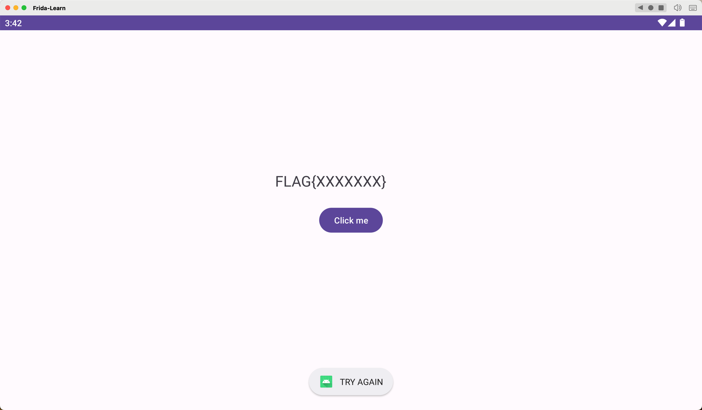
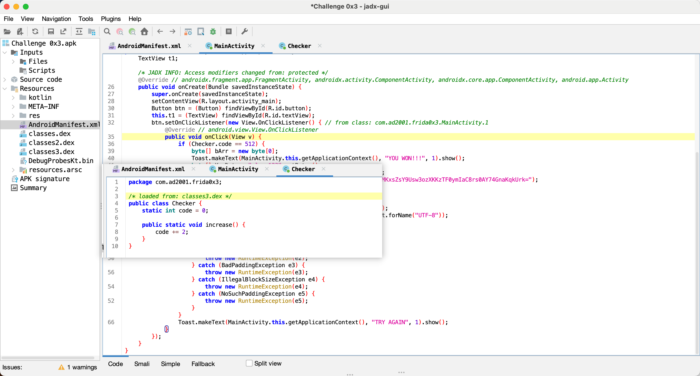
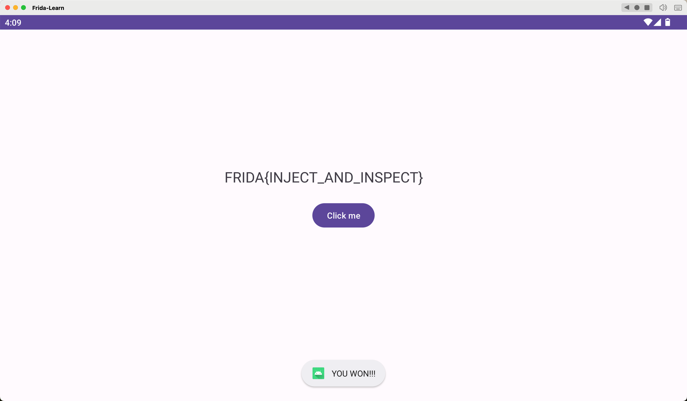

## Lab 03 修改类中变量

打开 APK



用 jadx-gui 反编译，这里需要 Click me，每次 Click + 2，当最终值为 512 时，能够得到 flag。



两种方法，一种把检测的值修改成 0，另外一种把 Checker 类里面的值修改为 512；PoC

```javascript
Java.perform(function () {

    // 声明了一个变量a来表示目标Android应用程序中的Java类。
    // Java.use函数指定要使用com.ad2001.frida0x3包中的Checker类。
    var a = Java.use("com.ad2001.frida0x3.Checker");

    // 使用变量a将所选类的code变量值修改为512
    a.code.value = 512; 

});
```



**总结**：Frida 更改变量值的脚本模板

```javascript
Java.perform(function (){

     var <class_reference> = Java.use(“<package_name>.<class>”);
     <class_reference>.<variable>.value = <value>; //需要修改的变量
})
```