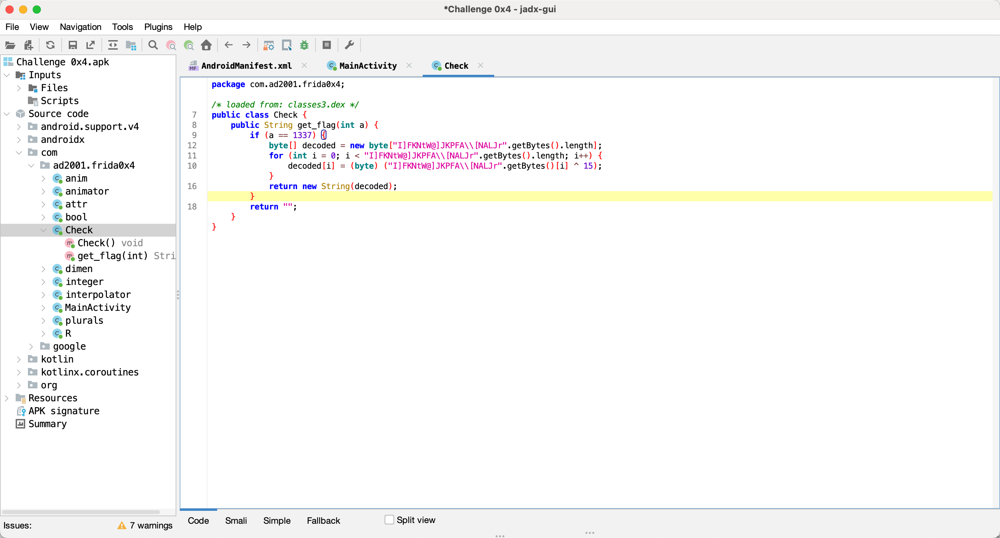
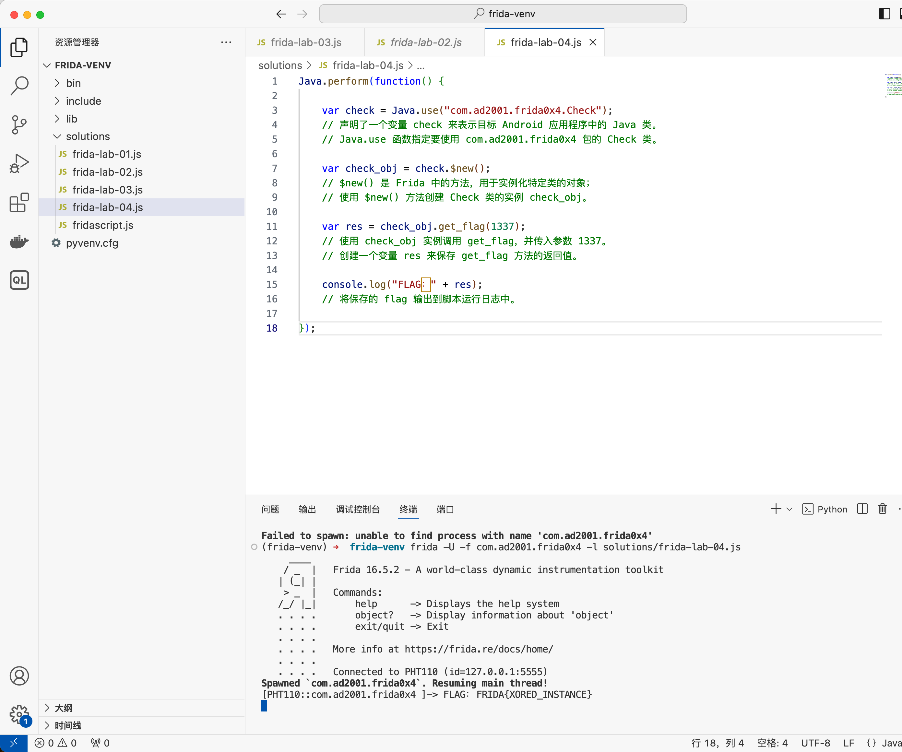

## Lab 04 创建类实例并调用动态方法

反编译去看 Main 发现 Main 里面没有东西。去看同 pkg 下的 Check 类



感觉和 02 一样，调用 `get_flag` 方法即可，然而这里的 get_flag 并不是静态方法，所以需要用 frida 先创建一个实例，再用这个实例来调用方法

```bash
frida -U -f com.ad2001.frida0x4 -l solutions/frida-lab-04.js
```



**总结**：Frida 创建类实例的脚本模板

```javascript
Java.perform(function() {

  var <class_reference> = Java.use("<package_name>.<class>");
  var <class_instance> = <class_reference>.$new(); // 创建类的实例
  <class_instance>.<method>(); // 调用该实例中的方法

})
```