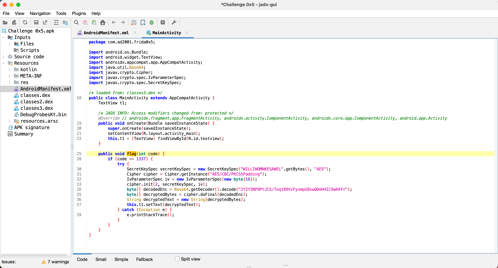
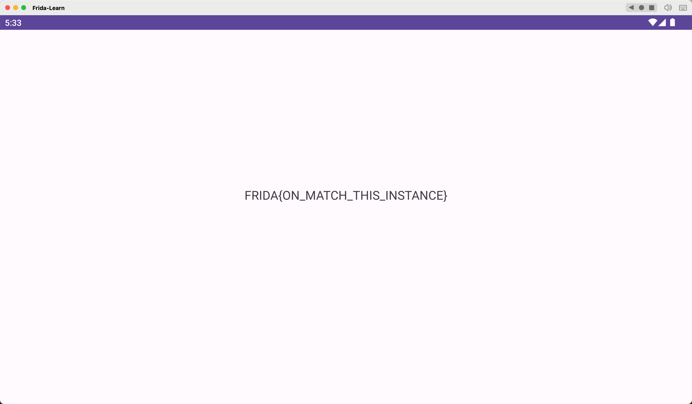

## Lab 05 调用 MainActivity 中的方法

看源代码，乍眼一看是可以的。




于是乎沿用 PoC，发现运行报错。

```javascript
Java.perform(function() {

    var check = Java.use("com.ad2001.frida0x5.MainActivity");
    // 声明了一个变量 check 来表示目标 Android 应用程序中的 Java 类。
    // Java.use 函数指定要使用 com.ad2001.frida0x4 包的 Check 类。

    var check_obj = check.$new(); 
    // $new() 是 Frida 中的方法，用于实例化特定类的对象；
    // 使用 $new() 方法创建 Check 类的实例 check_obj。

    var res = check_obj.flag(1337); 
    // 使用 check_obj 实例调用 get_flag，并传入参数 1337。
    // 创建一个变量 res 来保存 get_flag 方法的返回值。

    console.log("FLAG：" + res);
    // 将保存的 flag 输出到脚本运行日志中。

});
```

原因：**flag方法是属于MainActivity实例的，而上一题（4）中，check是单独的一个类实例，而MainActivity是Android组件，由于Android的生命周期和线程规则，Android组件需要依赖于应用程序上下文运行，在Frida中，我们缺少必要的上下文。例如：Android UI组件通常需要具有关联Looper的特定线程，如果涉及UI任务，需要在具有活动Looper的主线程上执行。总之，创建MainActivity的实例可能需要应用处于特定状态，并通过Frida管理整个生命周期，并不建议这样做。**

解决方法：**由于创建MainActivity实例是Android应用程序生命周期的一部分，当Android应用程序启动时，系统会创建MainActivity的一个实例（或AndroidManifest.xml文件中指定的启动器活动）。因此，我们可以使用Frida获取MainActivity的实例，然后调用flag方法来获取我们的标志。**

修改 PoC 为如下即可

```javascript
/*
Java.performNow是Frida中的一个函数，用于在Java运行时环境中执行代码。
*/

Java.performNow(function() {

  Java.choose('com.ad2001.frida0x5.MainActivity', {
    // Java.choose在运行时枚举作为第一个参数传入的Java类的实例。
    // 第二个参数需要传入包含onMatch和onComplete两个回调函数的选项对象。

      onMatch: function(instance) { 
        // 处理匹配到的类实例的回调函数
        // instance参数表示MainActivity类的每个匹配实例

        console.log("Instance found");
        // 找到实例时打印一条提示信息。
        instance.flag(1337); 
        // 调用flag方法，并传入参数1337。
    },
    onComplete: function() {}
    // 完成操作后的回调函数
  });
});
```

这里也需要 `frida -U 'Frida 0x5' -l solutions/frida-lab-05.js`



总结：**Frida 使用对象参数调用方法的脚本模板**

```JavaScript
Java.performNow(function() {
  Java.choose('<Package>.<class_Name>', {
    onMatch: function(instance) {
      var <class_reference> = Java.use("<package_name>.<class>");
      var <class_instance> = <class_reference>.$new(); // 创建类的实例
      /*
      设置实例参数
      */
      instance.<method>(class_instance); // 使用对象参数调用方法
    },
    onComplete: function() {}
    // 完成操作后的回调函数
  });
});
```