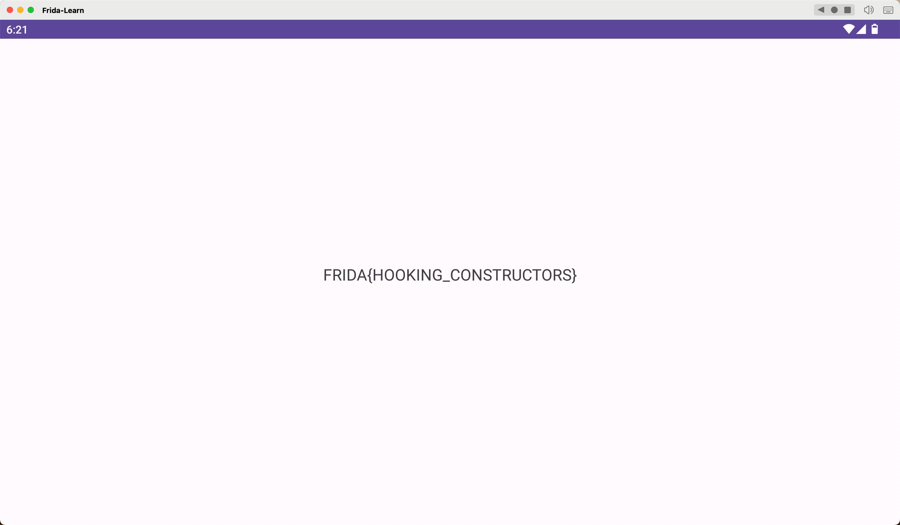

## Lab 07 hook 构造函数

感觉和 Lab06 类似，多了的地方仅仅是需要在 07 中多调用一个构造函数。

那么这里可以实例化，然后用 `$new` 就可以，因为 `$new` 为创建一个实例，默认会调用构造函数

```javascript
Java.performNow(function() {
  Java.choose('com.ad2001.frida0x7.MainActivity', {
    onMatch: function(instance) {
      console.log("Instance found");
      var checker = Java.use("com.ad2001.frida0x7.Checker");
      var checker_obj = checker.$new(1000, 1000);
      instance.flag(checker_obj);
    },
    onComplete: function() {}
  });
});
```

除此之外，我们也可以 hook 它的构造函数，官方文档中介绍了 `$init` 来 hook 构造函数的方法

```javascript
Java.perform(function() {
  var a =  Java.use("com.ad2001.frida0x7.Checker");
  a.$init.implementation = function(param){
    this.$init(600, 600);
  }
});
```



**从 08 开始，都是 Native 层的一些操作了