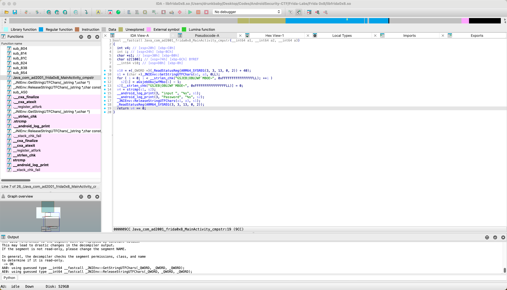
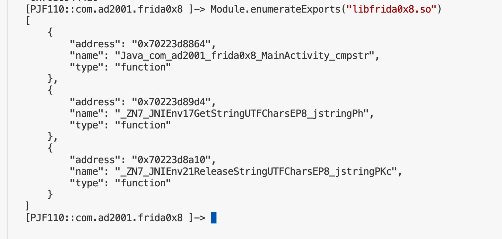
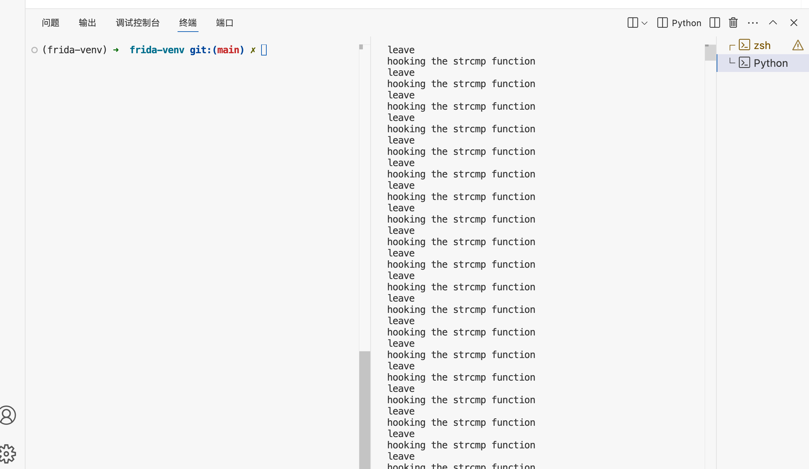
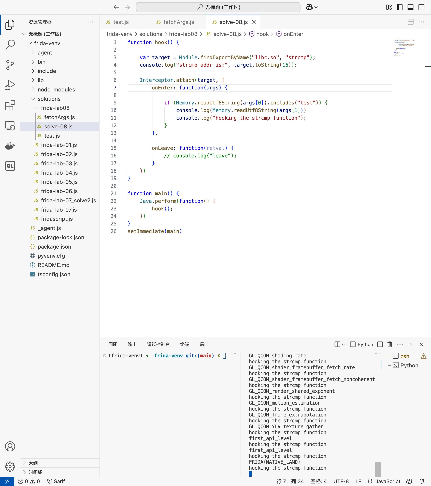

## Lab 08  Hook Native

### 基础模板 && api 学习

jadx-gui 打开反编译，代码和之前的相比复杂了一些

```java
public void onCreate(Bundle savedInstanceState) {
    super.onCreate(savedInstanceState);
    ActivityMainBinding inflate = ActivityMainBinding.inflate(getLayoutInflater());
    this.binding = inflate;
    setContentView(inflate.getRoot());
    this.edt = (EditText) findViewById(R.id.editTextText);
    Button button = (Button) findViewById(R.id.button);
    this.btn = button;
    button.setOnClickListener(new View.OnClickListener() { // from class: com.ad2001.frida0x8.MainActivity.1
        @Override // android.view.View.OnClickListener
        public void onClick(View v) {
            String ip = MainActivity.this.edt.getText().toString();
            int res = MainActivity.this.cmpstr(ip);
            if (res == 1) {
                Toast.makeText(MainActivity.this, "YEY YOU GOT THE FLAG " + ip, 1).show();
            } else {
                Toast.makeText(MainActivity.this, "TRY AGAIN", 1).show();
            }
        }
    });
}
```

只有当我们输入的内容是正确的 flag 时，**cmpstr** 方法的返回值是1时，就会输出表示正确的提示词，然后再输出 flag。但是我们可以看到该方法是 **native** 层的，里面有一层代码

```java
static {
    System.loadLibrary("frida0x8");
}
```

解压缩，然后我们在路径 `lib->x86_64->libfrida0x8.so`，打开 `libfrida0x8.so`  文件，用 ida64 分析，然后找到

***
2025.4.16 终于还是逃不过 frida 的一些使用和逆向，遂又重新回来学习一下 Frida-Lab-08，学习这个是因为 08 的 Lab 是要去动调 .so 和分析 so 的，很有学习价值。

先来看 Main 函数



Frida Hook Native 层的模板如下 https://frida.re/docs/javascript-api/#interceptor

```javascript
Interceptor.attach(Module.getExportByName('libc.so', 'read'), {
  onEnter(args) {
    this.fileDescriptor = args[0].toInt32();
  },
  onLeave(retval) {
    if (retval.toInt32() > 0) {
      /* do something with this.fileDescriptor */
    }
  }
});
```

官方文档的解释非常清晰，`Interceptor.attach(target, callbacks[, data]): intercept calls to function at . This is a target NativePointer specifying the address of the function you would like to intercept calls to. `

解释一下，意思是 `Interceptor.attach` 是用来 hook 某个函数的具体地址的，这里带有几个参数，`(target, callbacks[, data])`，target 的参数比较明确，也就是地址，在上面的 case 里面地址是用 `Module.getExportByName` 来获取的。

#### 获取地址的五种方法

除此之外，还有其他方法也可以获取到地址，如下 API 都是可以的

1. Module.enumerateExports()  
    通过调用 Module.enumerateExports()，input 参数一般是 `.so`，我们可以获取到导出函数的 类型、名称、地址。

2. Module.getExportByName()  
    当我们知道要查找的 `.so` 但不知道其地址时，可以使用 `Module.getExportByName()`。通过提供导出项的名称作为参数，这个函数会返回与该名称对应的导出项的地址。

3. Module.findExportByName()  
    这与 Module.getExportByName() 是一样的。唯一的区别在于，如果未找到导出项，Module.getExportByName() 会引发异常，而 Module.findExportByName() 如果未找到导出项则返回 null

4. Module.getBaseAddress()  
    通过调用 Module.getBaseAddress() 函数，我们可以获取指定模块的基址地址，然后可以基于这个基址地址进行偏移计算，以定位模块内部的特定函数、变量或者数据结构

5. Module.enumerateImports()  
    通过调用 Module.enumerateImports() 函数，我们可以获取到指定模块导入的外部函数或变量的名称、地址以及其他相关信息。

而 `callbacks[, data]` 这里的可选项只有 ` onEnter ` 和 ` onLeave `。根据官方文档记载

```javascript
onEnter(args): callback function given one argument that can be used to read or write arguments as an array of argsNativePointer objects. {: #interceptor-onenter}

onLeave(retval): callback function given one argument that is a retvalNativePointer-derived object containing the raw return value. You may call to replace the return value with the integer , or to replace with a pointer. Note that this object is recycled across onLeave calls, so do not store and use it outside your callback. Make a deep copy if you need to store the contained value, 

e.g.: 
.retval.replace(1337)1337
retval.replace(ptr("0x1234"))
ptr(retval.toString())
```

onEnter：当程序刚进入这个函数时，会执行 onEnter 这个回调。执行回调这里带一个参数 `args`，这个参数是可以查看与修改的。通过 `onEnter` 方法可以获取到当前这个 Context 中的很多信息。

onLeave：当函数执行完毕准备返回时，会执行 `onLeave`，在这里可以修改返回值。

讲完了关于 Native 层 Hook 模板的解释，先 hook 到对应的 apk，运行一下获取地址的 API 观察一下结果。

```bash
frida -U -f com.ad2001.frida0x8
```

用上述的 `Module.enumerateExports("libfrida0x8.so")` 函数来获取地址



同时如果这里想拿到单独的，也可以这样子指定 `Module.enumerateExports("libfrida0x8.so")[0]["address"]`
对于前面的 API，也有说过 `Module.getExportByName` 也是可以的，方法很简单 `Module.getExportByName("libfrida0x8.so","Java_com_ad2001_frida0x8_MainActivity_cmpstr")`

一般来说也只有这两种方法获得的地址是准确的，因为他们都能够指定对应的函数。还有其他的 API 也可以

`Module.getBaseAddress()` 这个 api 可以拿到对应 .so 的基础地址。其实拿到基础地址之后，只需要加上偏移量，就可以找到这个函数对应的具体地址。for this case

```bash
[PJF110::com.ad2001.frida0x8 ]-> Module.getBaseAddress("libfrida0x8.so")
"0x70223db000"
```

而 `Java_com_ad2001_frida0x8_MainActivity_cmpstr` 函数对应的偏移量其实是 `864`，通过 add 偏移量就可以拿到具体地址了

```bash
[PJF110::com.ad2001.frida0x8 ]-> Module.getB
aseAddress("libfrida0x8.so").add(0x864)
"0x70223db864"
```

最后还有一个 API 是 `Module.enumerateExports()` 也是类似的，但是这个 API 的作用是获取到当前 `libfrida0x8.so` 这个文件中，所被调用的其他 .so。

```bash
[PJF110::com.ad2001.frida0x8 ]-> Module.enum
erateImports("libfrida0x8.so")
[
    {
        "address": "0x70b68e05d8",
        "module": "/apex/com.android.runtime/lib64/bionic/libc.so",
        "name": "__cxa_finalize",
        "slot": "0x70223dccd0",
        "type": "function"
    },
    {
        "address": "0x70b68e0338",
        "module": "/apex/com.android.runtime/lib64/bionic/libc.so",
        "name": "__cxa_atexit",
        "slot": "0x70223dccd8",
        "type": "function"
    },
    {
        "address": "0x70b68ef374",
        "module": "/apex/com.android.runtime/lib64/bionic/libc.so",
        "name": "__register_atfork",
        "slot": "0x70223dcce0",
        "type": "function"
    },
    {
        "address": "0x70b691d408",
        "module": "/apex/com.android.runtime/lib64/bionic/libc.so",
        "name": "__strlen_chk",
        "slot": "0x70223dccf0",
        "type": "function"
    },
    {
        "address": "0x70b68da300",
        "module": "/apex/com.android.runtime/lib64/bionic/libc.so",
        "name": "strcmp",
        "slot": "0x70223dccf8",
        "type": "function"
    },
    {
        "address": "0x70b67a22bc",
        "module": "/system/lib64/liblog.so",
        "name": "__android_log_print",
        "slot": "0x70223dcd00",
        "type": "function"
    },
    {
        "address": "0x70b6907374",
        "module": "/apex/com.android.runtime/lib64/bionic/libc.so",
        "name": "__stack_chk_fail",
        "slot": "0x70223dcd10",
        "type": "function"
    }
]

```

这里可以看到第四个地方，libc.so，里面调用了 strcmp 方法，具体地址

```bash
[PJF110::com.ad2001.frida0x8 ]-> Module.enumerateImports("libfrida0x8.
so")[4]['address']
"0x70b68da300"
```
### solve Lab08

先来分析下代码

```c
bool __fastcall Java_com_ad2001_frida0x8_MainActivity_cmpstr(__int64 a1, __int64 a2, __int64 a3)
{
  int v4; // [xsp+20h] [xbp-C0h]
  int i; // [xsp+24h] [xbp-BCh]
  char *s1; // [xsp+30h] [xbp-B0h]
  char s2[100]; // [xsp+74h] [xbp-6Ch] BYREF
  __int64 v10; // [xsp+D8h] [xbp-8h]

  v10 = *(_QWORD *)(_ReadStatusReg(ARM64_SYSREG(3, 3, 13, 0, 2)) + 40);
  s1 = (char *)_JNIEnv::GetStringUTFChars(a1, a3, 0LL);
  for ( i = 0; i < __strlen_chk("GSJEB|OBUJWF`MBOE~", 0xFFFFFFFFFFFFFFFFLL); ++i )
    s2[i] = aGsjebObujwfMbo[i] - 1;
  s2[__strlen_chk("GSJEB|OBUJWF`MBOE~", 0xFFFFFFFFFFFFFFFFLL)] = 0;
  v4 = strcmp(s1, s2);
  __android_log_print(3, "input ", "%s", s1);
  __android_log_print(3, "Password", "%s", s2);
  _JNIEnv::ReleaseStringUTFChars(a1, a3, s1);
  _ReadStatusReg(ARM64_SYSREG(3, 3, 13, 0, 2));
  return v4 == 0;
}
```

s1 是我们的输入，经过一些处理后的部分。s2 是题目加密过后的字符串，比较 s1 和 s2 是否相同，如果相同则输出 flag。所以我们可以想办法把 strcmp 函数的第二个参数 hook 住，这样子就可以观察到对应的值。

先写一个测试脚本

```javascript
function hook() {

    var target = Module.findExportByName("libc.so", "strcmp");
    console.log("strcmp addr is:", target.toString(16));

    Interceptor.attach(target, {
        onEnter: function(args) {
            console.log("hooking the strcmp function");
        },

        onLeave: function(retval) {
            console.log("leave");
        }
    })
}

function main() {
    Java.perform(function() {
        hook();
    })
}
setImmediate(main)
```

hook 成功


接下来要想办法去 hook 到 strcmp 这个函数的第二个参数 s2，在 frida 中想要获取到内存中的一些字符串，可以用 `Memory.readUtf8String()` 函数。当然这里是读的地址

```javascript
function hook() {

    var target = Module.findExportByName("libc.so", "strcmp");
    console.log("strcmp addr is:", target.toString(16));

    Interceptor.attach(target, {
        onEnter: function(args) {
            console.log(Memory.readUtf8String(args[1]))

            if (Memory.readUtf8String(args[0]).includes("test")) {
                console.log("hooking the strcmp function");
            }
        },

        onLeave: function(retval) {
            // console.log("leave");
        }
    })
}

function main() {
    Java.perform(function() {
        hook();
    })
}
setImmediate(main)
```

但是这样子 hook 的时候，会输出都非常多的参数，这里其实是因为，我以为我hook的是特定的某一个strcmp，实际上这个 hook 是生效于所有调用 `libc.so#strcmp` 的地方，无论是 native 调用还是通过 JNI 被 Java 调用的 native 方法，都会被拦截

所以要加一个判断，当strcmp的第一个参数包含某个数（例如 test）时，就打印第二个参数的结果，使我们的目标更加“精确”，修改脚本如下

```javascript
function hook() {

    var target = Module.findExportByName("libc.so", "strcmp");
    console.log("strcmp addr is:", target.toString(16));

    Interceptor.attach(target, {
        onEnter: function(args) {

            if (Memory.readUtf8String(args[0]).includes("test")) {
                console.log(Memory.readUtf8String(args[1]))
                console.log("hooking the strcmp function");
            }
        },

        onLeave: function(retval) {
            // console.log("leave");
        }
    })
}

function main() {
    Java.perform(function() {
        hook();
    })
}
setImmediate(main)
```



得到 flag：FRIDA{NATIVE_LAND}

